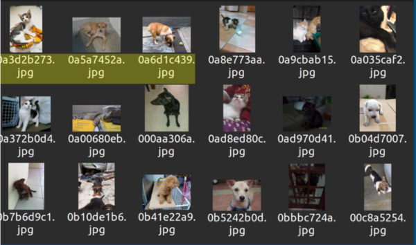
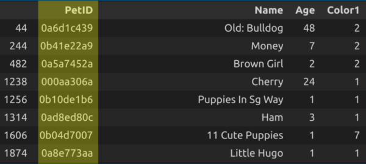
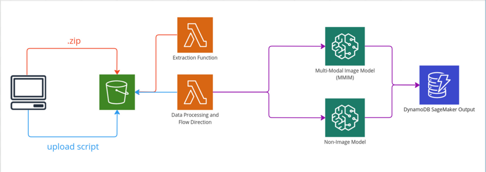

## Example Multimodal ML Workflow in AWS 

### **Goal**: 
Sketch out a flexible multimodal ML workflow in AWS which can be adapted to different applications by swapping out the dataset, processing logic, and models while making minimal changes to the architecture itself.

### **Data pattern**: 
Multimodal dataset with image and tabular files associated by primary ID. Some tabular records may be missing images, and some images may not have associated records of tabular data.





### **Model**:
One multi-modal model trained on all available modalities, with an optional second model trained on a subset of the modalities. At the modeling phase of the workflow, pass the name of the model you want to use into the function as either an environmental variable or a value in the API request. This way the same lambda function can be used to deploy different models on different datasets.




### **Workflow**: 
The event handling in this workflow can be handled without EventBridge by using S3 notifications and Lambda triggers ([tutorial](https://docs.aws.amazon.com/lambda/latest/dg/with-s3-example.html)) and by invoking one lambda function directly from another (code included in example functions). You can quickly spin up most of the infrastructure for this workflow by using the CloudFormation template `mm-cfn-workflow.yaml` (CFN [tutorial](https://docs.aws.amazon.com/AWSCloudFormation/latest/UserGuide/GettingStarted.Walkthrough.html)).

The CFN template should create everything except the Lambda function `lambda-mm-model` -- this is because an image must already exist in ECR before it can be used to create a lambda function. Follow the steps in `tutorials/lambda_fastapi_docker_tutorial.md` to build an image and deploy a Lambda function from it.

```
mm-cfn-workflow.yaml    

scripts/
├── upload.py           # example script to upload files
├── lambda-unzip.py     # Lambda function to extract .zip upload 
└── lambda-direct-flow.py     # Lambda data processing function

lambda-mm-model
├── app.py
├── Dockerfile 
├── models    
│   └── mm-binclass-model
│       ├── assets.json
│       ├── config.yaml
│       ├── data_processors.pkl
│       ├── df_preprocessor.pkl
│       ├── hf_text
│       │   ├── config.json
│       │   ├── special_tokens_map.json
│       │   ├── tokenizer_config.json
│       │   ├── tokenizer.json
│       │   └── vocab.txt
│       └── model.ckpt
├── README.md
└── requirements.txt
```  

`test/` contains sample images and tabular data from the [PetFinder Kaggle Competition](https://www.kaggle.com/c/petfinder-adoption-prediction) dataset. See [this](https://auto.gluon.ai/stable/tutorials/multimodal/multimodal_prediction/beginner_multimodal.html) tutorial for how to use the AutoGluon Auto-ML library on this data.

`tutorials/` contains instructions on how to host a jupyter notebook server from an EC2 instance to train your model, and instructions on how to build a Docker image from a FastAPI application and host it in Elastic Container Registry (ECR).

`lambda-mm-model/models` contains the files for the AutoGluon model. These files should not be included when building the Docker image and uploading it to ECR (hence why they are intentionally not copied in the Dockerfile). The application should instead download whatever model it's using from S3 at runtime -- this increases flexibility by removing the need to rebuild and redeploy the image whenever the model is updated or changed.  

---
## More details on workflow: 

### 1. Upload image files and tabular data to S3 bucket 

Events in S3 occur at the object level, meaning that many approaches to starting your workflow will trigger it every time an object is created in S3. This is not suitable in situations where one has many files to process at once. The best two solutions I've come up with are: 

**Option #1** -- Upload a single .zip file to the s3 bucket and use that single event to trigger a lambda function (`lambda-unzip.py`) to extract the contents and re-write them to a single folder in the s3 bucket. This function ends by triggering `lambda-direct-flow.py`.

* *Downside* -- requires another lambda function to run and thereby adds some cost. As projects scale you will need to increase the memory allotted to this function to ensure it can hold the files in memory as it extracts and re-writes them to S3.

**Option #2** -- Use an an upload script to upload your files and trigger `lambda-direct-flow.py` on completion (see `upload.py` for an example). This approach allows you to front-load some processing logic (e.g. check for corrupted image files, unexpected file types, unexpected columns in tabular files, etc.) before your data gets uploaded. 
* *Downside* -- requires local python setup (or at least the ability to use a shell script) and IAM access to the S3 bucket. Requires more technical proficiency on the part of the person uploading the data.


### 2. Process and direct data to the appropriate model

`lambda-direct-flow.py` processes the tabular data and checks the ID column against the list of image filenames in the same directory. It separates records which have corresponding images and those that don't, materializing them to separate files in the bucket's `tmp/` folder. It then triggers the multimodal image model (`lambda-mm-model/app.py`) via two API calls, once for the data with images and once for the data without images. 


### 3. Generate & save predictions

`mm-image-model` is created from a Docker image of a FastAPI application that is uploaded to ECR. Hosting your functions as container images lets you get around the 250 MB dependency limit in Lambda, which is necessary for using most machine learning libraries. 

When triggered, `mm-image-model`runs in two concurrent instances in two Lambda execution environments, one for the data with images and the other for the data without images. In each instance, the function downloads the model from the S3 bucket, reads the appropriate file from the `tmp/` directory, generates predictions, and writes records to the DynamoDB table with the new predicted values and a flag for which version of the model generated them (image or non-image). This flag is checked by the image version of the model before it writes to the database, and it will update any records which previously had predictions generated by the non-image model.


* *Downside* -- Building and deploying a Docker image is A.) more time consuming B.) less flexible, since once it's uploaded there's no in-cloud editing. Use environmental variables from the AWS console, values in the API calls, and models stored in S3 to avoid having to rebuild and re-deploy the function when things change. This is also why we keep the processing logic in the first Lambda function `lambda-direct-flow.py`.


